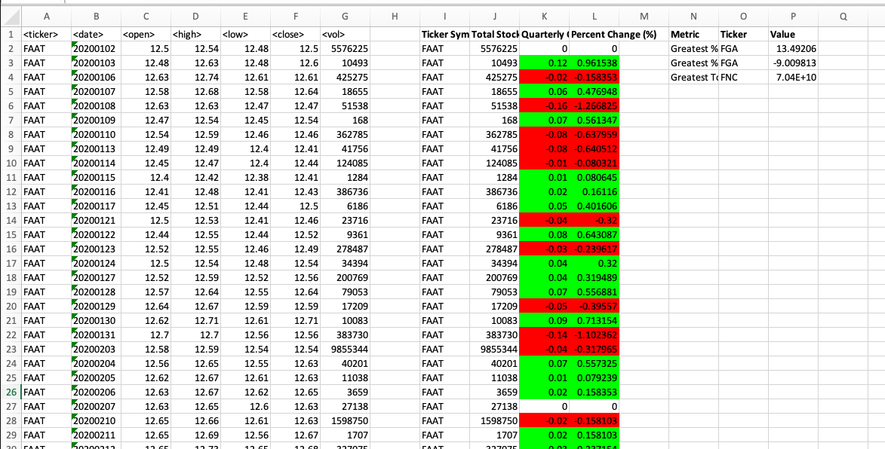

# VBA Stock Analysis Challenge

## Overview
This project involves using VBA scripting to analyze stock market data. The script processes stock data for each quarter, calculates key metrics, and applies conditional formatting to highlight significant changes.

## Repository Structure
- `AnalyzeStocks.vba`: The main VBA script file containing the analysis logic.
- `alphabetical_testing.xlsx`: A smaller dataset used for testing the script.
- `README.md`: Documentation file providing an overview of the project and instructions for usage.

## Instructions

### 1. Setting Up the Environment
1. Create a new repository named `VBA-challenge`.
2. Add the `AnalyzeStocks.vba` script file to the repository.
3. Include the `alphabetical_testing.xlsx` file for testing purposes.

### 2. Running the Script
1. Open the `alphabetical_testing.xlsx` file in Excel.
2. Load the `AnalyzeStocks.vba` script in the VBA editor.
3. Run the `AnalyzeStocks` macro.
4. The script will loop through each worksheet, process the stock data, and output the results in new columns.

### 3. Output Metrics
The script calculates and outputs the following metrics for each stock ticker:
- **Ticker Symbol**
- **Total Stock Volume**
- **Quarterly Change ($)**
- **Percent Change (%)**

Additionally, the script identifies and outputs the following extreme values:
- **Greatest % Increase**
- **Greatest % Decrease**
- **Greatest Total Volume**

### 4. Conditional Formatting
The script applies conditional formatting to the `Quarterly Change` and `Percent Change` columns:
- **Positive Changes** are highlighted in green.
- **Negative Changes** are highlighted in red.

## Example Results
After running the script, the output should look similar to the following:

| Ticker Symbol | Total Stock Volume | Quarterly Change ($) | Percent Change (%) |
|---------------|--------------------|----------------------|--------------------|
| ABC           | 1,200,000          | 5.00                 | 10.00%             |
| XYZ           | 850,000            | -3.00                | -5.00%             |

Extreme values:
- **Greatest % Increase**: Ticker XYZ (15.00%)
- **Greatest % Decrease**: Ticker ABC (-10.00%)
- **Greatest Total Volume**: Ticker DEF (2,000,000)

## Example Image
Here is an example image showing the output:

